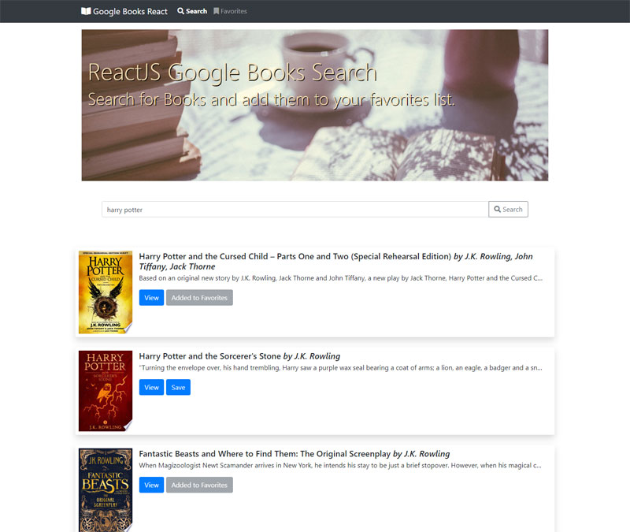

# [MERN Stack Google Books Search (link)](https://oc-googlebooks.herokuapp.com/)

## Overview
A Full Stack MERN (MongoDB, Express, React, and Node.js) Google Books Search app. The app contains React components, work with helper/util functions, and React lifecycle methods to query and display books based on user searches. Also used are Node, Express and MongoDB so that users can save books to review or purchase later.



## Technologies/Frameworks used:
Here are the technologies that you need to install 
* [ReactJS](https://reactjs.org/) A JavaScript library for building user interfaces
* [Bootstrap](https://getbootstrap.com/) An open source toolkit for developing with HTML, CSS, and JS. 
* [Node.js](https://nodejs.org/en/) A JavaScript runtime built on Chrome's V8 JavaScript engine.
* [MongoDB](https://www.mongodb.com/) A NoSQL Database that uses JSON-like data with schemata.
* [Google Books API](https://developers.google.com/books/) An API that can perform full-text searches and retrieve book information, viewability and eBook availability.
* Node.js Modules:
    * [react-router-dom](https://www.npmjs.com/package/react-router-dom) DOM bindings for React Router.
    * [Express](https://www.npmjs.com/package/express) Fast, unopinionated, minimalist web framework for node.
    * [Mongoose](https://www.npmjs.com/package/mongoose) A MongoDB object modeling tool designed to work in an asynchronous environment.
    * [Express package](https://www.npmjs.com/package/express) Fast, unopinionated, minimalist web framework.
    * [Express Handlebars](https://www.npmjs.com/package/express-handlebars) Node module as the view engine for Express
    * [Axios](https://www.npmjs.com/package/axios) Promise based HTTP client for the browser and node.js

## App functionality
* **Search** - User can search for books via the Google Books API and render them here. User has the option to "*View*" a book, bringing them to the book on Google Books, or "*Save*" a book, saving it to the Mongo database.

* **Favorites** - Renders all books saved to the Mongo database. User has an option to "*View*" the book, bringing them to the book on Google Books, or "*Delete*" a book, removing it from the Mongo database.

## React Pages
* Search Page - also the home page
* Favorites Page - contains saved books from the MongoDB database

## React Components
* Navbar - top navbar section
* Title - Jumbotron title section
* ViewBtn - button for viewing full details from Google Books API website
* SaveBtn - button for saving book to database
* DeleteBtn - button for deleting book from database

## Mongoose Schema
* Database: `googlebooks`
* The `Books` collection schema contains the following fields:
    * title
    * authors
    * description
    * image
    * link
* The `Documents` collection shema contains the following fields:
    * authors
    * description
    * image
    * link
    * title

## Express Routes for the Server
* `/api/books` **(GET)** - Should return all saved books as JSON.
    * Get search string from form body with `request.body`
* `/api/books` **(POST)** - Will be used to save a new book to the database.
* `/api/books/:id` **(DELETE)** - Will be used to delete a book from the database by Mongo _id.
* `*` **(GET)** - Will load your single HTML page in `client/build/index.html`. Must be declared last otherwise everythig will go to `index.html`.
* `<NavLink>` A special version of the `<Link>` that will add styling attributes to the rendered element when it matches the current URL.
* `activeClassName` and `/` Root path problem!
    * To correct this you must add **`exact`** so that the path is matched *EXACTLY*!
    ```
    <NavLink exact to="/" className="nav-link">
        Google Books React
    </NavLink>
    ```

## Workflow of the app
1. on `componentDidMount()`: 
    * the `loadBooks()` method calls `API.getBooks()` which makes a HTTP GET REQUEST to path `/books`
        * `booksController` GET method finds all the books from the API
            * save the response to state with `setState({ books: response.data })`
            * render to Books component using `.map()` method
2. on Search Submit the string is sent to the `/api/books` as a GET request, with the search string sent as a JSON object.
    * send as 
    ```
    axios.post(url, {key: value})
    .then (function (response) {
        
    })
    ```


This project was bootstrapped with [Create React App](https://github.com/facebook/create-react-app).

## Available Scripts

In the project directory, you can run:

### `npm start`

Runs the app in the development mode.<br>
Open [http://localhost:3000](http://localhost:3000) to view it in the browser.

The page will reload if you make edits.<br>
You will also see any lint errors in the console.

### `npm test`

Launches the test runner in the interactive watch mode.<br>
See the section about [running tests](https://facebook.github.io/create-react-app/docs/running-tests) for more information.

### `npm run build`

Builds the app for production to the `build` folder.<br>
It correctly bundles React in production mode and optimizes the build for the best performance.

The build is minified and the filenames include the hashes.<br>
Your app is ready to be deployed!

See the section about [deployment](https://facebook.github.io/create-react-app/docs/deployment) for more information.

### `npm run eject`

**Note: this is a one-way operation. Once you `eject`, you can’t go back!**

If you aren’t satisfied with the build tool and configuration choices, you can `eject` at any time. This command will remove the single build dependency from your project.

Instead, it will copy all the configuration files and the transitive dependencies (Webpack, Babel, ESLint, etc) right into your project so you have full control over them. All of the commands except `eject` will still work, but they will point to the copied scripts so you can tweak them. At this point you’re on your own.

You don’t have to ever use `eject`. The curated feature set is suitable for small and middle deployments, and you shouldn’t feel obligated to use this feature. However we understand that this tool wouldn’t be useful if you couldn’t customize it when you are ready for it.

## Learn More

You can learn more in the [Create React App documentation](https://facebook.github.io/create-react-app/docs/getting-started).

To learn React, check out the [React documentation](https://reactjs.org/).

### Code Splitting

This section has moved here: https://facebook.github.io/create-react-app/docs/code-splitting

### Analyzing the Bundle Size

This section has moved here: https://facebook.github.io/create-react-app/docs/analyzing-the-bundle-size

### Making a Progressive Web App

This section has moved here: https://facebook.github.io/create-react-app/docs/making-a-progressive-web-app

### Advanced Configuration

This section has moved here: https://facebook.github.io/create-react-app/docs/advanced-configuration

### Deployment

This section has moved here: https://facebook.github.io/create-react-app/docs/deployment

### `npm run build` fails to minify

This section has moved here: https://facebook.github.io/create-react-app/docs/troubleshooting#npm-run-build-fails-to-minify
